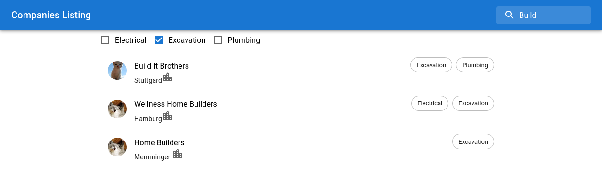

# Companies Listing

# [Client](https://github.com/jennypavlova/companies-listing/tree/master/client)

## Available Scripts

### `npm run start`

Runs on [http://localhost:3000](http://localhost:3000)

### `npm run test`

### `npm run build`

## Screenshots
- Filter by specialty and company name


- Filter by name


- Filter by specialty


# [Server](https://github.com/jennypavlova/companies-listing/tree/master/server)

## Prereqiusite
- Node > v14

## Available Scripts

### `npm run start`

Runs on [http://localhost:4000](http://localhost:4000)

### `npm run test`

### `npm run build`

## API endpoints

GET ``api/companies``

```
curl http://localhost:4000/api/companies
```
Returns a list with companies

GET ``api/specialities``
```
curl http://localhost:4000/api/specialities
```
Returns a list with all specialities based on the information in the companies


# Improvements ideas

- Improve the UI/UX:
    - Implement autocomplete on Search
    - Mobile version should be improved with a better layout
- Structure:
    - Combine server part and client part folders in one Monerepo to make it possible to share types and dependencies between them.
    - Add config for differnt enviroments and CI setup for running the tests
- Code Quality and scalability:
    - In case of a big amount of data implement pagination so the server will return only part of the data and the frontend will load it on demand.
    - Add more tests (including an e2e test as well)
